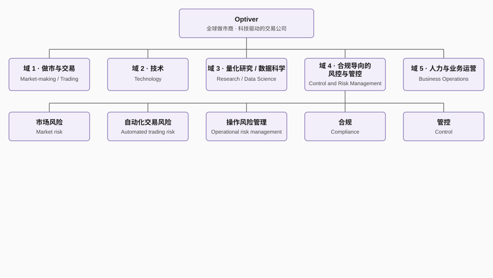

# Optiver 核心算法、策略与动态定价引擎完整文档

## 一、Optiver 为何能成为全球四大做市商

### 1. 业界领先的算法与策略
1. **动态定价引擎（核心壁垒）**
   以实时波动率曲面为基础，融合订单簿微观结构、仓位风险与硬件加速，每秒上万次更新报价，在极端波动下仍能提供精准、连续的双边报价，定价精度与响应速度行业顶尖。

2. **波动率曲面实时建模与修正**
   超越传统 Black-Scholes 模型，对行权价×到期日全链条波动率进行毫秒级拟合与动态修正，严格满足无套利约束，是期权做市的核心竞争力。

3. **市场微观结构策略**
   实时分析盘口深度、订单流毒性、成交概率，智能决定挂单价格与位置，在保证成交效率的同时，大幅降低被知情单收割的风险。

4. **基于强化学习的策略迭代**
   以强化学习自动迭代做市策略，结合海量实盘数据持续优化报价、对冲与风控逻辑，策略迭代效率远超行业平均水平。

5. **跨资产统计套利与对冲**
   捕捉股票/期货/ETF/期权之间的价格错配，通过高频、精准的对冲锁定收益，在指数期权与大宗商品衍生品上表现突出。

6. **毫秒级全维度 Greeks 风控**
   实时计算 Delta、Gamma、Vega、Theta、Vanna、Vomma 等高阶风险敞口，一旦超限自动加宽价差、缩量甚至单边报价，极端行情下几乎无重大风险事件。

---

### 2. 跻身全球四大做市商的核心原因
- **期权做市能力全球标杆**
  在欧美及亚太主要交易所的指数期权、单股票期权市场长期占据头部流动性提供商位置，波动率定价与风险管理能力业内公认最强。

- **极致低延迟技术底座**
  自研 FPGA 硬件加速，将定价逻辑固化到芯片，端到端延迟进入微秒级；全球机房直连交易所，专用链路保证确定性执行。

- **全球多市场分散布局**
  业务覆盖 50+ 交易所，欧洲、亚太、北美均衡发力，单一市场剧烈波动不会影响整体稳定性，抗风险能力显著强于区域性做市商。

- **员工持股+极强风控文化**
  合伙制架构，长期导向而非短期利润；风控纪律极强，宁可少赚、不冒不可控风险，在历次危机中表现极其稳健。

- **全链路自动化闭环**
  从定价、成交、风险计算到自动对冲完全自动化，无需人工干预，在高波动、高订单流场景下依然稳定运行。

---

### 3. 相对四大之外做市商的核心优势
1. **定价精度差距**
   对波动率曲面、高阶风险、微观结构的建模深度，是中小做市商难以投入的技术壁垒，报价更准、价差更紧、亏损更少。

2. **硬件与基础设施差距**
   FPGA、专用微波/光纤、全球托管机房，投入量级以十亿美元计，普通机构无法复制。

3. **跨资产协同与对冲能力**
   可同时在股票、期货、期权、外汇、商品上定价与对冲，风险分散与对冲效率远超单一资产做市商。

4. **极端行情生存能力**
   2020 熔断、2022 加息、2024 波动日等极端环境下，Optiver 持续报价、不崩系统、不爆仓，大量中小做市商直接撤单停市。

5. **人才与研发壁垒**
   汇聚全球顶尖数理、工程人才，研发投入占比极高，算法、模型、系统长期领跑，形成强者恒强的正循环。

---

## 二、Optiver 动态定价引擎是如何工作的

### 1. 核心定位
Optiver 动态定价引擎 =
**实时波动率曲面 + 订单簿微观结构 + 仓位 Greeks 风控 + FPGA 硬件加速**

是一套**毫秒级自动报价+对冲闭环系统**，决定买卖报价、价差、挂单量与对冲行为。

---

### 2. 完整工作流程
1. **底层定价：实时波动率曲面计算**
- 对全期权链条（行权价 × 到期日）实时拟合隐含波动率
- 市场跳空、大单冲击、波动率突变时**毫秒级修正**
- 强制满足无套利约束，杜绝日历套利、蝶式套利等错误定价

2. **中间层：微观结构与成交预测**
- 分析盘口买一卖一深度、挂单/撤单速度、订单流毒性
- 计算不同价位的**成交概率**与**被收割风险**
- 智能决定最优挂单位置，实现“高成交、低风险”

3. **上层：仓位与风险控制**
- 实时计算全组合 Delta、Gamma、Vega 等高阶 Greeks
- 风险超限 → 自动加宽价差
- 单边敞口过大 → 只报单边或暂停报价
- 尾部风险过高 → 强制缩量保护

4. **输出：生成最终买卖报价**
   公允理论价 + 流动性溢价 - 风险成本
- 买价 = 公允价 - 价差/2
- 卖价 = 公允价 + 价差/2

5. **闭环：成交后自动对冲**
- 成交后立即计算剩余风险敞口
- 在股票/期货市场自动完成 Delta 等对冲
- 对冲完成后立刻重新计算新报价，进入下一轮循环

---

### 3. 硬件支撑：为什么能做到极致快？
- **FPGA 硬件固化定价公式**，跳过软件层延迟
- **微秒级数据与报价更新**
- 交易所托管 + 专用低延迟线路
- 全链路无瓶颈、无单点故障

---

### 4. 一句话总结
**Optiver 动态定价引擎，以实时波动率为核心、微观结构为依据、风控为边界、硬件为速度，实现“报价准、成交稳、风险可控、极端不崩”的全自动做市闭环，是其成为全球顶级做市商的核心心脏。**